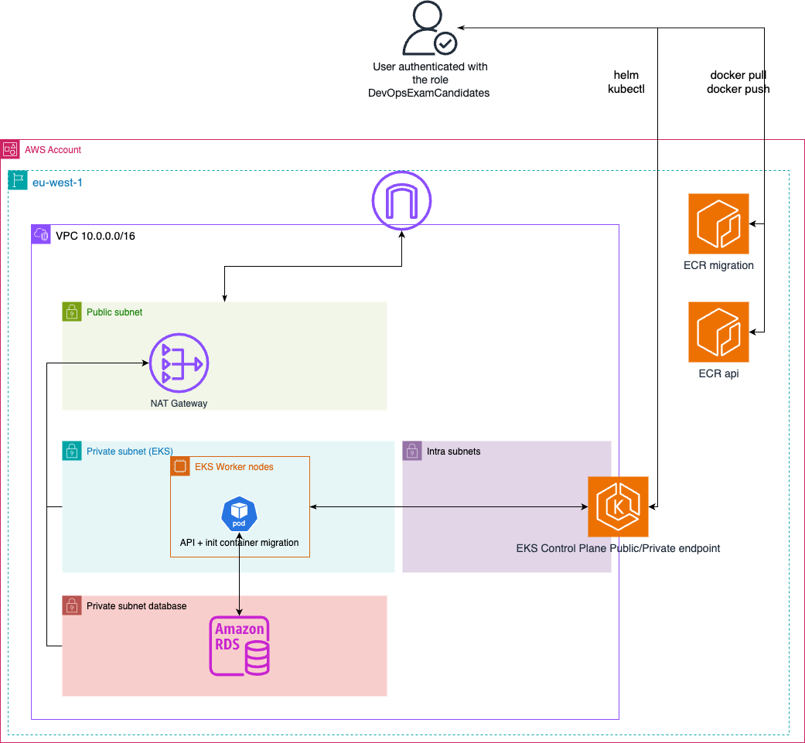

# Solution Test Technique DevOps/SRE

## 🚀 Deploy AWS infrastructure
### 🖥️ Requirements
Need awscli to be install and to be configured as follow:
- Copy paste this to your file ~/.aws/config

```bash
[profile exam]
sso_session = jump
sso_account_id = 376129852544
sso_role_name = DevOpsExamCandidates
region = eu-west-1

[sso-session jump]
sso_start_url = https://jump.awsapps.com/start/#
sso_region = eu-west-1
sso_registration_scopes = sso:account:access
```


You need to be authenticated to the AWS account 376129852544 and assuming the SSO role DevOpsExamCandidates

```bash
$> aws sso login --sso-session jump 
```
You can check that you are authenticated

```bash
$> aws sts get-caller-identity --profile exam --no-cli-pager
```

Make sure to export you AWS profile that you will be using

```bash
$> export AWS_PROFILE=exam
```

You can check that you are authenticated
```bash
$> aws sts get-caller-identity --profile exam --no-cli-pager
```

Need to install `terragrunt >= v0.73.7` & `terraform >= v1.10.5` 

### 🚀 Deploy AWS stack
The stack that we will deployed is composed by several modules:
- vpc (subnets, routes, nat gateway)
- eks cluster
- ecr (2 ecr repositories api + migrate )
- rds (postgres db)



You need to go in the folder infrastructure/live/prod
```bash
$> cd infrasructure/live/prod

$> terragrunt plan-all
$> terragrunt apply-all
```
It will take around 20-30 minutes due to EKS cluster creation & RDS

## ☸️ Deploy application api in EKS
### 🖥️ Push images to the ECR
Need to have docker installed `docker >= 27.4.0`

Need to get login password to connect to the registry

```bash
$> aws ecr get-login-password --region eu-west-1 --profile exam | docker login --username AWS --password-stdin 376129852544.dkr.ecr.eu-west-1.amazonaws.com
```

#### Build Images

Migration image
```bash
$> docker build . -t migration:0.0.0  --platform=linux/arm64,linux/amd64 -f ./applications/services/a/db/Dockerfile
$> docker tag migration:0.0.0 376129852544.dkr.ecr.eu-west-1.amazonaws.com/migration-prod:v0.0.0
$> docker push 376129852544.dkr.ecr.eu-west-1.amazonaws.com/migration-prod:v0.0.0
```
API image

```bash
$> docker build . -t api/a:0.0.0 --platform=linux/arm64,linux/amd64 -f ./applications/services/a/Dockerfile
$> docker tag api/a:0.0.0 376129852544.dkr.ecr.eu-west-1.amazonaws.com/api-prod:v0.0.0
$> docker push 376129852544.dkr.ecr.eu-west-1.amazonaws.com/api-prod:v0.0.0
```


### Connect to EKS Cluster

```bash
$> aws eks update-kubeconfig --region eu-west-1 --name prod --alias exam-jump --profile exam
```

### Deploy Helm chart
```bash
$> export POSTGRES_HOST=$(aws rds describe-db-instances \
    --query 'DBInstances[*].[Endpoint.Address]' \
    --filters Name=db-instance-id,Values=prod \
    --output text --no-cli-pager)

$> helm upgrade api --install  ./deployments/helm/api -n default --set db.configuration.host="$POSTGRES_HOST"
```

### Check if it works
```
$> kubectl --namespace default port-forward svc/api  8080:8080
$> curl 127.0.0.1:8080/users | jq
$> curl -v 127.0.0.1:8080/readiness
$> curl -v 127.0.0.1:8080/liveness
```

## 💣 Destroy the stack
```bash
$> cd infrasructure/live/prod

$> terragrunt destroy-all
```
